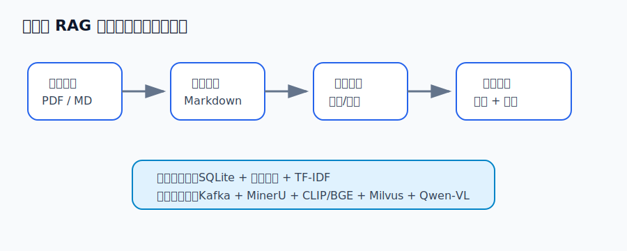

# 多模态 RAG 示例报告

本报告用于演示一个多模态 RAG 聊天机器人的最小流程。

系统包含文件上传、离线解析、索引构建、图文检索和聊天回答五个核心模块。

## 系统架构

用户先上传 PDF 或 Markdown 文档，系统保存原始文件，并记录文档状态。离线解析任务会把文档转换成 Markdown，同时保留图片链接。

解析后的文本会被切分成多个 chunk。每个 chunk 可以建立文本向量；如果 chunk 中包含图片，也可以建立图片向量。

## 检索问答

当用户提问时，系统会先检索相关文本和图片，再将资料拼接给大模型。最终回答应尽量基于已有资料，并保留可追溯来源。

本示例使用本地 TF-IDF 检索替代真实向量数据库，目的是让作业代码更容易运行和理解。
